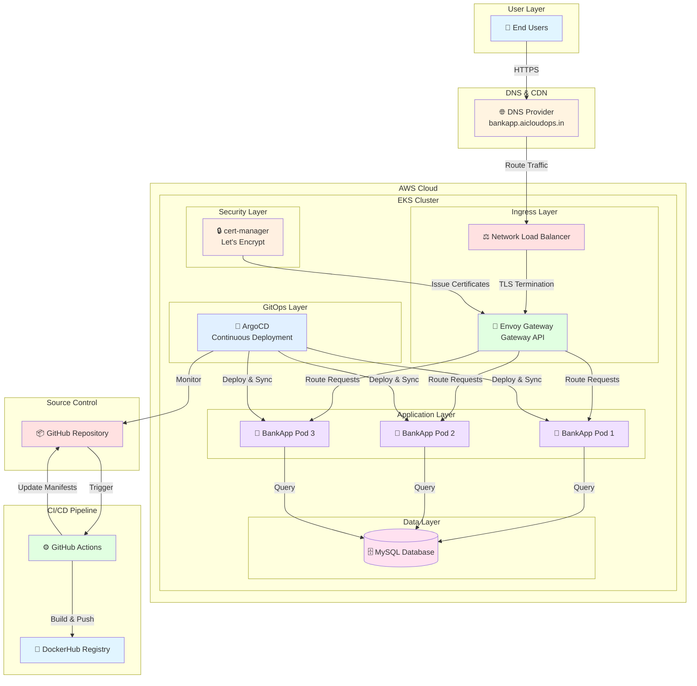
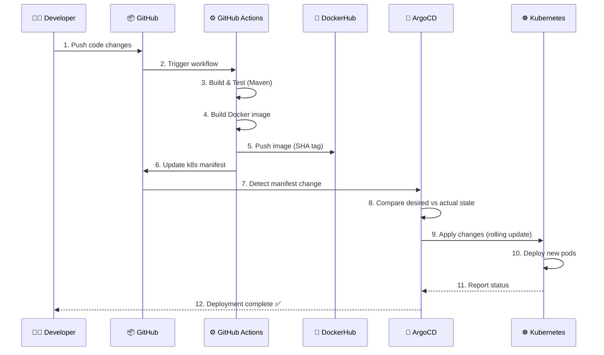
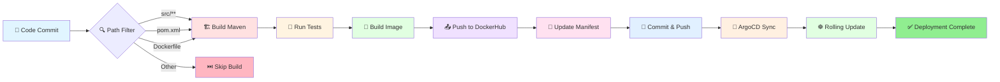
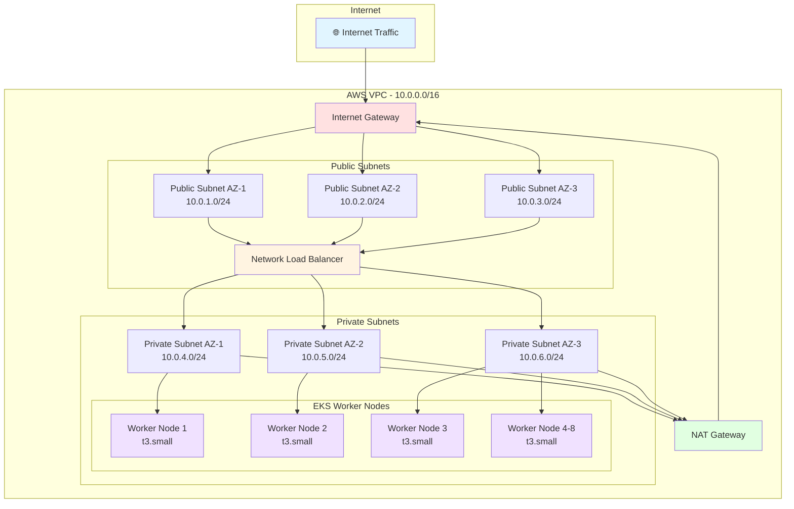
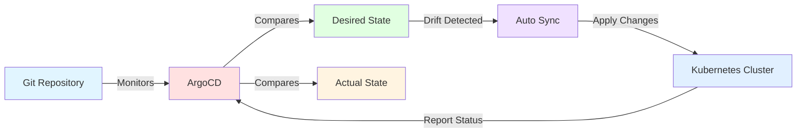
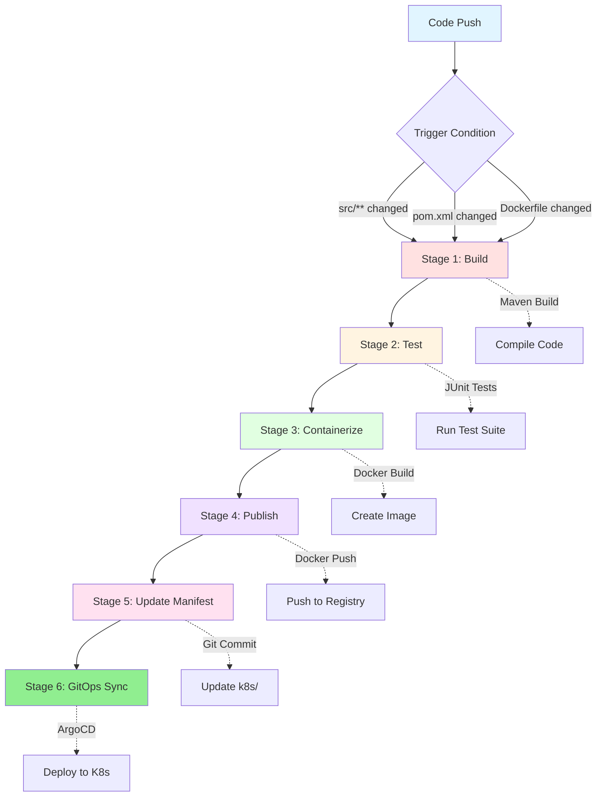

# 🏦 AI BankApp - Production-Ready GitOps Deployment

[](https://github.com/features/actions)
[](https://argoproj.github.io/cd/)
[](https://kubernetes.io/)
[](https://hub.docker.com/)
[](https://www.terraform.io/)

> A modern, cloud-native banking application demonstrating enterprise-grade DevOps practices with GitOps, CI/CD automation, and production-ready Kubernetes deployment on AWS EKS.

**🌐 Live Demo:** [https://bankapp.aicloudops.in](https://bankapp.aicloudops.in)

---

## 📋 Table of Contents

- [Overview](#-overview)
- [Architecture](#-architecture)
- [Technology Stack](#-technology-stack)
- [Features](#-features)
- [GitOps Workflow](#-gitops-workflow)
- [CI/CD Pipeline](#-cicd-pipeline)
- [Infrastructure](#-infrastructure)
- [Getting Started](#-getting-started)
- [Deployment Guide](#-deployment-guide)
- [Monitoring & Observability](#-monitoring--observability)
- [Security](#-security)
- [Contributing](#-contributing)

---

## 🎯 Overview

AI BankApp is a full-stack banking application built with **Spring Boot** and deployed on **AWS EKS** using modern DevOps practices. The project showcases:

- ✅ **GitOps-based deployment** with ArgoCD
- ✅ **Automated CI/CD** with GitHub Actions
- ✅ **Infrastructure as Code** with Terraform
- ✅ **Container orchestration** with Kubernetes
- ✅ **Zero-downtime deployments** with rolling updates
- ✅ **TLS/HTTPS** with Let's Encrypt certificates
- ✅ **API Gateway** with Envoy Gateway
- ✅ **Production-ready** monitoring and logging

---

## 🏗️ Architecture

### High-Level Architecture



### GitOps Workflow



### CI/CD Pipeline Flow



### Network Architecture



---

## 🛠️ Technology Stack

### Application Layer
- **Backend:** Spring Boot 3.x (Java 21)
- **Frontend:** Thymeleaf, HTML5, CSS3, JavaScript
- **Database:** MySQL 8.0
- **Build Tool:** Maven 3.9+

### Infrastructure & DevOps
- **Cloud Provider:** AWS (EKS, VPC, EBS, NLB)
- **Container Runtime:** Docker
- **Orchestration:** Kubernetes 1.28+
- **IaC:** Terraform 1.5.7+
- **GitOps:** ArgoCD 2.9+
- **CI/CD:** GitHub Actions
- **API Gateway:** Envoy Gateway (Gateway API v1.2)
- **Certificate Management:** cert-manager + Let's Encrypt
- **Container Registry:** DockerHub

### Monitoring & Security
- **TLS/SSL:** Let's Encrypt (Automated)
- **Secrets Management:** Kubernetes Secrets
- **Network Policy:** Kubernetes NetworkPolicy
- **Resource Management:** Resource Quotas & Limits

---

## ✨ Features

### Application Features
- 🏦 **Account Management** - Create and manage bank accounts
- 💰 **Transactions** - Deposit, withdraw, and transfer funds
- 📊 **Dashboard** - Real-time account overview
- 🔐 **Authentication** - Secure user login and registration
- 🤖 **AI Chatbot** - Intelligent customer support (placeholder)
- 📱 **Responsive Design** - Mobile-friendly interface

### DevOps Features
- 🔄 **GitOps Deployment** - Declarative, version-controlled infrastructure
- 🚀 **Zero-Downtime Deployments** - Rolling updates with health checks
- 🔒 **Automated TLS** - Let's Encrypt certificate management
- 📈 **Horizontal Scaling** - HPA for auto-scaling based on load
- 🔍 **Health Monitoring** - Liveness and readiness probes
- 🏗️ **Infrastructure as Code** - Complete Terraform automation
- 🔐 **Security Best Practices** - Non-root containers, resource limits

---

## 🔄 GitOps Workflow

### What is GitOps?

GitOps is a modern approach to continuous deployment where:
- **Git is the single source of truth** for infrastructure and application configuration
- **Automated processes** sync the desired state from Git to production
- **Changes are made via pull requests** with proper review and approval
- **Rollbacks are simple** - just revert the Git commit

### Our GitOps Implementation



**Benefits:**
- ✅ **Declarative** - Describe what you want, not how to get there
- ✅ **Versioned** - Every change is tracked in Git
- ✅ **Auditable** - Complete history of who changed what and when
- ✅ **Automated** - No manual kubectl commands needed
- ✅ **Recoverable** - Easy rollback to any previous state

---

## 🚀 CI/CD Pipeline

### Pipeline Stages



### Workflow Configuration

**Triggers:**
- Push to `feat/gitops` branch
- Changes in: `src/**`, `pom.xml`, `Dockerfile`
- Manual trigger via `workflow_dispatch`

**Steps:**
1. **Checkout** - Clone repository
2. **Setup JDK** - Install Java 21 (Temurin)
3. **Build** - Maven clean package
4. **Test** - Run JUnit tests
5. **Tag** - Generate short commit SHA
6. **Login** - Authenticate to DockerHub
7. **Build Image** - Multi-platform Docker build
8. **Push** - Upload to DockerHub (latest + SHA tag)
9. **Update Manifest** - Modify k8s/bankapp-deployment.yml
10. **Commit** - Push manifest change (triggers ArgoCD)

---

## 🏗️ Infrastructure

### AWS EKS Cluster

**Specifications:**
- **Cluster Name:** bankapp-eks
- **Region:** us-west-2
- **Kubernetes Version:** 1.28+
- **Node Type:** t3.small (2 vCPU, 2GB RAM)
- **Node Count:** 8 nodes
- **Availability Zones:** 3 (us-west-2a, us-west-2b, us-west-2c)

### VPC Configuration

```
VPC CIDR: 10.0.0.0/16

Public Subnets:
  - 10.0.1.0/24 (us-west-2a)
  - 10.0.2.0/24 (us-west-2b)
  - 10.0.3.0/24 (us-west-2c)

Private Subnets:
  - 10.0.4.0/24 (us-west-2a)
  - 10.0.5.0/24 (us-west-2b)
  - 10.0.6.0/24 (us-west-2c)
```

### Kubernetes Resources

**Namespaces:**
- `bankapp` - Application workloads
- `argocd` - GitOps controller
- `cert-manager` - Certificate management
- `envoy-gateway-system` - API Gateway
- `monitoring` - Prometheus & Grafana stack

**Deployments:**
- `bankapp` - 3 replicas (Spring Boot app)
- `mysql` - 1 replica (Database)
- `kube-prometheus-stack` - Monitoring components

**Services:**
- `bankapp-service` - ClusterIP (internal)
- `mysql-service` - ClusterIP (internal)

**Gateway:**
- `bankapp-gateway` - HTTP (80) + HTTPS (443)
- TLS certificate from Let's Encrypt

---

## 🚀 Getting Started

### Prerequisites

- AWS Account with appropriate permissions
- AWS CLI configured
- Terraform >= 1.5.7
- kubectl installed
- Helm 3 installed
- Docker with buildx support
- DockerHub account
- Domain name with DNS management

### Quick Start

1. **Clone the repository**
   ```bash
   git clone https://github.com/Ramiz-Takildar/AI-BankApp-DevOps.git
   cd AI-BankApp-DevOps
   ```

2. **Configure AWS credentials**
   ```bash
   aws configure
   ```

3. **Update configuration**
   - Edit `terraform/terraform.tfvars`
   - Update `k8s/gateway.yml` with your domain
   - Update `k8s/certificate.yml` with your domain
   - Update `k8s/bankapp-deployment.yml` with your DockerHub image

4. **Deploy infrastructure**
   ```bash
   cd terraform
   terraform init
   terraform apply -auto-approve
   ```

5. **Configure kubectl**
   ```bash
   aws eks update-kubeconfig --name bankapp-eks --region us-west-2
   ```

6. **Follow the deployment guide**
   See [DEPLOYMENT_GUIDE_2026.md](./DEPLOYMENT_GUIDE_2026.md) for detailed steps

---

## 📖 Deployment Guide

For complete step-by-step deployment instructions, see:
- **[DEPLOYMENT_GUIDE_2026.md](./DEPLOYMENT_GUIDE_2026.md)** - Production deployment guide
- **[DEPLOYMENT.md](./DEPLOYMENT.md)** - Original deployment documentation

### Key Deployment Steps

1. ✅ Provision AWS infrastructure (Terraform)
2. ✅ Install Gateway API CRDs
3. ✅ Install Envoy Gateway
4. ✅ Install cert-manager (with Gateway API support)
5. ✅ Update Kubernetes manifests
6. ✅ Build and push Docker image
7. ✅ Configure DNS A record
8. ✅ Deploy via ArgoCD
9. ✅ Verify TLS certificate issuance
10. ✅ Access application via HTTPS

---

## 📊 Monitoring & Observability

### Monitoring Stack (kube-prometheus-stack)

**Components Deployed:**
- ✅ **Prometheus** - Metrics collection and storage
- ✅ **Grafana** - Visualization and dashboards
- ✅ **Alertmanager** - Alert routing and management
- ✅ **Node Exporters** - Hardware and OS metrics (10 pods)
- ✅ **Kube State Metrics** - Kubernetes object metrics

**Installation:**
```bash
# Add Prometheus Helm repository
helm repo add prometheus-community https://prometheus-community.github.io/helm-charts
helm repo update

# Install monitoring stack
helm install kube-prometheus prometheus-community/kube-prometheus-stack \
  -n monitoring \
  --create-namespace \
  --set grafana.service.type=LoadBalancer \
  --timeout=10m
```

### Grafana Dashboard Access

**Get Grafana URL:**
```bash
kubectl get svc kube-prometheus-grafana -n monitoring \
  -o jsonpath='{.status.loadBalancer.ingress[0].hostname}'
```

**Get Admin Password:**
```bash
kubectl get secret kube-prometheus-grafana -n monitoring \
  -o jsonpath='{.data.admin-password}' | base64 -d; echo
```

**Login:** `admin` / `<password from above>`

### Pre-configured Dashboards

**Kubernetes Monitoring:**
- `Kubernetes / Compute Resources / Cluster` - Overall cluster metrics
- `Kubernetes / Compute Resources / Namespace (Pods)` - Per-namespace metrics
- `Kubernetes / Compute Resources / Node (Pods)` - Per-node metrics
- `Node Exporter / Nodes` - Hardware and OS metrics

**Monitor BankApp:**
1. Navigate to: `Kubernetes / Compute Resources / Namespace (Pods)`
2. Select namespace: `bankapp`
3. View metrics: CPU, memory, network I/O, restart count

### Application Health Checks

**Liveness Probe:**
```yaml
httpGet:
  path: /actuator/health
  port: 8080
initialDelaySeconds: 60
periodSeconds: 10
```

**Readiness Probe:**
```yaml
httpGet:
  path: /actuator/health
  port: 8080
initialDelaySeconds: 30
failureThreshold: 15
```

### Resource Monitoring

**Pod Resources:**
```yaml
requests:
  memory: "256Mi"
  cpu: "250m"
limits:
  memory: "512Mi"
  cpu: "500m"
```

### Key Metrics to Monitor

- **CPU Usage** - Track application and node CPU utilization
- **Memory Usage** - Monitor memory consumption and potential leaks
- **Network I/O** - Observe traffic patterns and bandwidth
- **Pod Restarts** - Identify stability issues
- **Request Latency** - Application response times
- **Error Rates** - Track failed requests and errors

### ArgoCD Dashboard

Access ArgoCD UI:
```bash
kubectl get svc argocd-server -n argocd
# Use LoadBalancer URL with admin credentials
```

---

## 🔒 Security

### Security Features

- ✅ **TLS/HTTPS** - Automated Let's Encrypt certificates
- ✅ **Non-root containers** - Security context enforced
- ✅ **Resource limits** - Prevent resource exhaustion
- ✅ **Network policies** - Control pod-to-pod communication
- ✅ **Secrets management** - Kubernetes secrets for sensitive data
- ✅ **RBAC** - Role-based access control
- ✅ **Private subnets** - Worker nodes in private network
- ✅ **Security groups** - AWS network-level security

### Best Practices Implemented

1. **Least Privilege** - Minimal IAM permissions
2. **Immutable Infrastructure** - No manual changes
3. **Automated Updates** - GitOps-driven deployments
4. **Audit Trail** - All changes tracked in Git
5. **Encrypted Communication** - TLS everywhere
6. **Container Scanning** - Image vulnerability checks

---

## 🤝 Contributing

Contributions are welcome! Please follow these steps:

1. Fork the repository
2. Create a feature branch (`git checkout -b feature/amazing-feature`)
3. Commit your changes (`git commit -m 'Add amazing feature'`)
4. Push to the branch (`git push origin feature/amazing-feature`)
5. Open a Pull Request

### Development Workflow

```bash
# 1. Make changes to application code
vim src/main/java/com/example/bankapp/...

# 2. Test locally
./mvnw spring-boot:run

# 3. Commit and push
git add .
git commit -m "feat: add new feature"
git push origin feat/gitops

# 4. GitHub Actions will automatically:
#    - Build the application
#    - Run tests
#    - Build Docker image
#    - Push to DockerHub
#    - Update Kubernetes manifest
#    - Trigger ArgoCD sync
```

---

## 📝 Project Structure

```
AI-BankApp-DevOps/
├── .github/
│   └── workflows/
│       └── gitops-ci.yml          # GitHub Actions CI/CD pipeline
├── argocd/
│   └── application.yml            # ArgoCD application definition
├── k8s/
│   ├── namespace.yml              # Kubernetes namespace
│   ├── bankapp-deployment.yml     # Application deployment
│   ├── mysql-deployment.yml       # Database deployment
│   ├── service.yml                # Kubernetes services
│   ├── gateway.yml                # Envoy Gateway configuration
│   ├── certificate.yml            # TLS certificate
│   ├── cert-manager.yml           # cert-manager ClusterIssuer
│   ├── configmap.yml              # Application configuration
│   ├── secrets.yml                # Sensitive data
│   ├── pv.yml                     # Persistent volume
│   ├── pvc.yml                    # Persistent volume claim
│   └── hpa.yml                    # Horizontal Pod Autoscaler
├── terraform/
│   ├── provider.tf                # AWS provider configuration
│   ├── vpc.tf                     # VPC and networking
│   ├── eks.tf                     # EKS cluster
│   ├── argocd.tf                  # ArgoCD installation
│   ├── variables.tf               # Input variables
│   ├── outputs.tf                 # Output values
│   └── terraform.tfvars           # Variable values
├── src/
│   ├── main/
│   │   ├── java/                  # Java source code
│   │   └── resources/             # Application resources
│   └── test/                      # Test files
├── Dockerfile                     # Container image definition
├── pom.xml                        # Maven configuration
├── README.md                      # This file
├── DEPLOYMENT_GUIDE_2026.md       # Detailed deployment guide
└── DEPLOYMENT.md                  # Original deployment docs
```

---

## 📊 Service Access Summary

| Service | Access Method | Credentials |
|---------|--------------|-------------|
| **BankApp** | `https://bankapp.aicloudops.in` | Application-specific |
| **ArgoCD** | `kubectl get svc argocd-server -n argocd -o jsonpath='{.status.loadBalancer.ingress[0].hostname}'` | admin / (from secret) |
| **Grafana** | `kubectl get svc kube-prometheus-grafana -n monitoring -o jsonpath='{.status.loadBalancer.ingress[0].hostname}'` | admin / (from secret) |
| **Prometheus** | `kubectl port-forward -n monitoring svc/kube-prometheus-kube-prome-prometheus 9090:9090` | No authentication |

**Get Secrets:**
```bash
# ArgoCD admin password
kubectl get secret argocd-initial-admin-secret -n argocd \
  -o jsonpath='{.data.password}' | base64 -d; echo

# Grafana admin password
kubectl get secret kube-prometheus-grafana -n monitoring \
  -o jsonpath='{.data.admin-password}' | base64 -d; echo
```

---

## 🎓 Learning Resources

### GitOps
- [ArgoCD Documentation](https://argo-cd.readthedocs.io/)
- [GitOps Principles](https://www.gitops.tech/)

### Kubernetes
- [Kubernetes Documentation](https://kubernetes.io/docs/)
- [Gateway API](https://gateway-api.sigs.k8s.io/)

### CI/CD
- [GitHub Actions](https://docs.github.com/en/actions)
- [Docker Best Practices](https://docs.docker.com/develop/dev-best-practices/)

### Infrastructure as Code
- [Terraform AWS Provider](https://registry.terraform.io/providers/hashicorp/aws/latest/docs)
- [EKS Best Practices](https://aws.github.io/aws-eks-best-practices/)

### Monitoring & Observability
- [Prometheus Documentation](https://prometheus.io/docs/)
- [Grafana Documentation](https://grafana.com/docs/)
- [kube-prometheus-stack](https://github.com/prometheus-community/helm-charts/tree/main/charts/kube-prometheus-stack)

---

## 📄 License

This project is licensed under the MIT License - see the [LICENSE](LICENSE) file for details.

---

## 👥 Authors

- **Ramiz Takildar** - *Initial work* - [GitHub](https://github.com/Ramiz-Takildar)

---

## 🙏 Acknowledgments

- Spring Boot team for the excellent framework
- ArgoCD community for GitOps tooling
- Kubernetes community for container orchestration
- AWS for cloud infrastructure
- Envoy Gateway for API Gateway implementation
- cert-manager for automated certificate management

---

## 📞 Support

For issues, questions, or contributions:
- 🐛 [Report a Bug](https://github.com/Ramiz-Takildar/AI-BankApp-DevOps/issues)
- 💡 [Request a Feature](https://github.com/Ramiz-Takildar/AI-BankApp-DevOps/issues)
- 📧 Contact: [Your Email]

---

## 🌟 Star History

If you find this project helpful, please consider giving it a ⭐!

---

<div align="center">

**Built with ❤️ using GitOps, Kubernetes, and modern DevOps practices**

[⬆ Back to Top](#-ai-bankapp---production-ready-gitops-deployment)

</div>